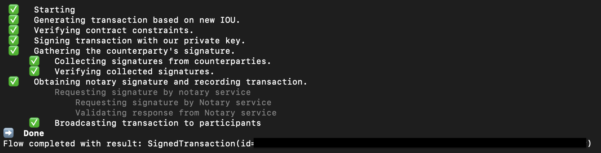

# cordapp-example 

This cordapp-example application allows a party (lender) to issue an IOU to another party (borrower).


## States

* `IOUState`: This is a [LinearState](https://docs.r3.com/en/platform/corda/4.9/community/api-states.html#linearstate) and a [QueryableState](https://docs.r3.com/en/platform/corda/4.9/community/api-states.html#the-queryablestate-and-schedulablestate-interfaces) that represents an IOU that can be issued by one party (lender) to another party (borrower).
* `SilverBarState`: This is a [LinearState](https://docs.r3.com/en/platform/corda/4.9/community/api-states.html#linearstate) and a [QueryableState](https://docs.r3.com/en/platform/corda/4.9/community/api-states.html#the-queryablestate-and-schedulablestate-interfaces) that represents a silver bar. It includes information about the weight of the silver bar, the owner (Party), and the issuer (Party).

## Contracts

* `IOUContract`: This is used to govern the evolution of an IOUState. This file includes validation rules governing the `Create` command for `IOUState`.
* `SilverBarContract`: This governs the evolution of a `SilverBarState`. It includes validation rules for issuing a silver bar. Specifically, it ensures that no inputs are consumed, only one output state is created, and the weight of the silver bar is positive.

## Flows

* `ExampleFlow`: This flow is used to create an `IOUState`. It takes 2 arguments as the parameters: the `iouValue` (Int) and the `otherParty` (Party).
* `IssueSilverBarFlow`: This flow is used to create a `SilverBarState`. It takes 2 arguments as the parameters: the `weight` (Double) of the silver bar and the `owner` (Party). It handles the generation, verification, and signing of the transaction, and gathers the required signatures from other involved parties before finalizing the transaction.

## Pre-requisites:
[Set up for CorDapp development](https://docs.r3.com/en/platform/corda/4.9/community/getting-set-up.html)

## Running the nodes:
1. Open a terminal and go to the project root directory and type: (to deploy the nodes using bootstrapper)
```
./gradlew clean build deployNodes
```
2. Then type: (to run the nodes)
```
./build/nodes/runnodes
```
This should open up 3 new tabs in the terminal window with Corda interactive shells. 

One for the Notary, one for Party A, and one for Party B.
(If any of the nodes is missing a Corda interactive shell, from the root folder, navigate to ```./build/node/{missing party node}``` and run ```java -jar corda.jar``` to boot up the Corda interactive shell manually.)

3. Next, navigate to the Party A Corda interactive shell to start the `ExampleFlow` to issue an IOU (from Party A (lender) to Party B (borrower)). Type the following command:
```
flow start ExampleFlow$Initiator iouValue: 20, otherParty: PartyB
```
You should see the following output in the terminal:



4. To check that you've successfully issued an IOU from Party A to Party B, navigate to the Party B Corda interactive shell to check all of the existing `IOUState` in Party B's vault. Type:
```
run vaultQuery contractStateType: "net.corda.samples.example.states.IOUState"
```
This command will output all the States in Party B's vault which has a contract state type of `IOUState`.

You've now successfully issued an `IOUState` of value 20, from Party A to Party B!

### ExampleFlow for SilverBar
To create a Silver Bar, you can start the `IssueSilverBarFlow` from the command line or via an RPC client:
```
flow start IssueSilverBarFlow weight: 10.0, owner: PartyB
```

To check that you've successfully issued an IOU from Party A to Party B, navigate to the Party B Corda interactive shell to check all of the existing `IOUState` in Party B's vault. Type:
```
run vaultQuery contractStateType: "net.corda.samples.example.states.SilverBarState"
```
